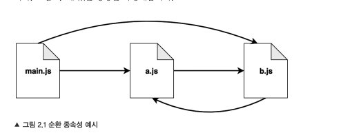

## 모듈의 필요성
 - 좋은 모듈 시스템은 소프트웨어 엔지니어링의 몇 가지 기본적인 필요성을 마주할 때 도움을 줍니다
   - 코드베이스를 나누어 여러 파일을 분할하는 방법을 제시합니다. 이것은 코드를 좀 더 구조적으로 관리 할 수 있게 해주고 각각으로부터 독립적인 기능의 조각들을 개발 및 테스트 하는 데에 도움을 주며 이해하기 쉽게 해줌
   - 다른 프로젝트에 코드를 재사용 실제로 모듈은 다른 프로젝트에도 유용하고 일반적이 특성을 구현 가능 모듈로서 기능을 구조화하는 것이 그 기능들이 필요한 다른 프로젝트로 좀 더 쉽게 이동시킬 수 있습니다.
   - 은닉성을 제공합니다. 일반적으로 복잡한 구현을 숨긴 채 명료한 책임을 가진 간단한 인터페이스만 노출시키는 것이 좋은 방식입니다. 대부분의 모듈 시스템은 함수와 클래스 또는 객체와 같이 모듈 사용자가 이용하도록 공개 인터페이스를 노출시키는 반면, 공개하지 않으려는 코드를 선택적으로 공개되지 않도록 해줍니다.
   - 종속성을 관리합니다. 좋은 모듈시스템은 서드파티를 포함하여 모듈 개발자로 하여금 기존에 있는 모듈에 의존하여 쉽게 빌드할 수 있게 해줌
   - 또한 모듈 시스템은 모듈 사용자가 주어진 모듈의 실행에 있어 필요한(일시적 종속성들) 일련의 종속성들을 쉽게 임포트할 수 있게 해줍니다.
   - 모듈은 소프트웨어의 실제 유닛으로 정의할 수 있스니다.

## 노출식 모듈 패턴
````js
const myModule = (() => {
  const privateFoo = () =>{}
  const privateBar = []
  const exported ={
  publicFoo: () =>{ },  
  publicBar: () =>{ }  
}
  return exported
})()
````
 - 이 패턴은 자기 호출 함수를 사용
 - 이러한 종류의 함수를 즉시 실행 함수 표현(IIFE: Immediately Invoked Function Expression) 이라고 부름 private 범위를 만들고 공개될 부분만 내보내게 됩니다.

## 모듈 정의
 - 기억해야 할 기본 개념은 module.exports 변수에 할당되지 않는 이상, 모듈 안의 모든 것이 비공개라는 것
 - require() 를 사용하여 모듈을 로드 할 때 변수의 내용은 캐시되고 리턴 됩니다.

## module.exports 대 export
 - nodejs 에 익숙하지 않은 많은 개발자들이 공통적으로 혼란스러워 하는 것은 public API를 공개 하기 위해 사용하는 module.exports 와 export 의 차이점임
 - 변수 export 는 module.exports의 초기 값에 대한 참조일 뿐이다. 우리는 이 값이 본질적으로 모듈이 로드되기 전에 만들어지는 간단한 객체 리터럴이라는것을 확인
 - 
 - 즉 다음 코드와 같이 export가 참조하는 객체에만 새로운 속성(property)을 추가할 수 있다.
````js
exports.hello = () =>{
  console.log("Hello");
}
````
 - exports 변수의 재할당은 module.exports 의 내용을 변경하지 않기 때문에 아무런 효과가 없다. 그것은 exports 변수 자체만을 재할당
 - 따라서 아래코드는 잘못된것
````js
exports = () =>{
  console.log("Hello")
}
````
 - 함수, 인스턴스 또는 문자열과 같은 객체 리터럴 이외의 것을 내보내려면 다음과 같이 module.exports를 다시 할당해야함
````js
module.exports = () =>{
  console.log("Hello")
}
````

### require 함수는 동기적이다.
 - 실제로 간단한 직접 스타일을 사용하여 모듈 내용을 반환하므로 콜백이 필요하지 않다.
 - 그래서 module.exportss에 대한 할당도 역시 동기적이어야한다.
````js
setTimeout(()=>{
  module.exports = function (){}
}, 100)
````

## 모듈 캐시
 - require()의 후속 호출은 단순히 캐시된 버전을 반환하기 때문에 각 모듈은 처음 로드될 때만 로드되고 평가됨
 - 우리가 직접 만든 함수의 코드를 보면 분명해짐
 - 캐싱은 성능을 위해 매우 중요하지만 다음과 같은 기능적인 영향도 있다.
   - 모듈 종속성 내에서 순환을 가질 수 있다.
   - 일정한 패키지 내에서 동일한 모듈이 필요할 때 얼마간 동일한 인스턴스가 항상 반환된다는것을 보장
 - 모듈 캐시는 require.cache 변수를 통해 외부에 노출되므로 필요한 경우 모듈 캐시에 직접 접근도 가능 

## 순환종속성
 - 많은 사람들이 순환 종속성을 내재된 설계문제로 생각하지만, 실제 프로젝트에서 발생할 수 있기 때문에 CommonJS 에서 어떻게 작동하는지 아는것이 좋을것 
 - require()함수를 다시 보면 이것이 어떻게 동작하는지, 무엇을 조심해야 하는지 알 수 있음

 - 모듈은 main.js에 a.js와 b.js 를 require로 불러옴 차례대로 a.js는 b.js를 require로 불러옴. 하지만 b.js또한 a.js 에 다시 의존.
 - 모듈 a.js 가 require 로 b.js를 부르고 b.js가 require로 a.js 를 부르는 것에서 분명히 순환 종속성을 가지고 있는 걸 알 수 있다.
 