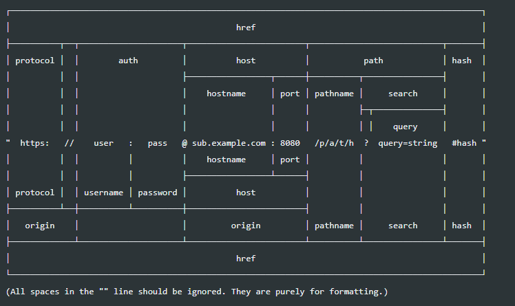

## REPL
 - 자바스크립트는 스크립트 언어라서 즉석에서 코드를 실행할 수있음
 - REPL이라는 콘솔제공
 - R(Read), E(Evaluate), P(Print), L(Loop)
 - 윈도에서는 명령 프롬프트 , 맥이나 리눅스에서는 터미널에 node 를 입력

#### ** 3장은 사전같은거라서 외우려고하면 안됨 

## console 객체
 - 브라우저의 console 객체와 매우 유사
 - console.time, console.timeEnd : 시간로깅 -> 코드를 짜고 맨위에 time 찍고 밑에 timeEnd찍으면 그 사이의 코드들의 시간을알려줌
 - console.error : 에러 로깅
 - console.log
 - console.dir : 객체로깅
 - console.trace : 호출스택 로깅

## module.exports
 - 한가지만 익스포트하고싶을때는 module.exports= ;
 - 두개이상일때는 
 - export.x = x; 
 - export.y = y;
 - or
 - module.exports={x,y};
 - module.exports 와 exports 는 같이 쓰면 안된다.
 - true === module.exports === {} === export
 - ** 하드디스크에서 메모리로 불러오는걸 캐싱이라고한대요

## Process
 - 현재 실행중이 노드 프로세스에 대한 정보를 담고 있음
 - version, arch, platform, pid(현재 프로세스의 아이디), uptime(프로세스가 시작된 후 흐른시간 단위는 초)
 - execPath(노드의 경로), cwd(프로세스가 실행되는 위치- 노드명령어를 어디서 실행했는지 알 수 있음(자주씀))

## process.env
 - 시스템 환경 변수들이 들어있는 객체
 - 비밀키(데이터베이스 비밀번호, 서드파티 앱 키 등)를 보관하는 용도로도 쓰임 - 암호화할때 이게뭔가했었는데..-진짜 그 자바 설치 할 때 환경변수랑 같은거였음
 - 환경변수는 process.env로 접근가능
````javascript
const secretID = process.env.SECRET_ID;
const secretCode = process.env.secretCode;
````

## path(관련 메서드들 확인해보기)
 - 알아서 경로 처리해주기 때문에 경로처리할때는 왠만하면 이거 써서처리허자
````javascript
const path = require('path');

path.join(__dirname,'var.js'); // 이런식으로 알아서 변환해줌
// window - \chapter3\var.js
// linux - /chapter3/var.js
````

## URL


## util
 -각종 편의 기능을 모둔 모듈
 - deprecated - uitl.deprecated(fuction) 이런식으로 해서 잘못만들었거나 교체해야할 함수를 알려주는 기능
 - promisify 

## worker Thread 생략

## childProcess
````javascript
const spawn = require('child_process').spawn;   // 다른프로세스 실핼 시킬수 있음
const process = spawn('python',['test.py']);    // 이런식으로 다른 프로세스로 다른언어 ㄱㄱ 가능
````

## fs 모듈 
````javascript
const fs = require('fs').promises;  // .promises 안써봤는데 이렇게하면 fs는 알아서 비동기처리 된다네? 

fs.readFile('./readme.txt')
    .then(()=>{
        console.log(data);
        console.log(data.toString());
        
    })
    .catch((err)=>{
       throw err;
    });
// 대신 콜백이아니고 이렇게 받아야겠쥬?
````
 - 비동기로 하되 순서대로
````javascript
const fs = require('fs').promises; 

async function main(){
    let data = await fs.readFile('./text.txt')
    console.log('1번', data.toString())
    data = await fs.readFile('./text.txt')
    console.log('2번',data.toString())
    data = await fs.readFile('./text.txt')
    console.log('3번',data.toString())
    data = await fs.readFile('./text.txt')
    console.log('4번',data.toString())
}
````
## 버퍼와 스트림 이해하기
 - 버퍼 : 일정한 크기로 모아두는 데이터
    - 일정한 크기가 되면 한 번에 처리
    - 버퍼링 : 버퍼레 데이터가 찰 때까지 모으는 작업
 - 스트림 : 데이터의 흐름
    - 일정한 크기로 나눠서 여러번에 걸쳐서 처리
    - 버처(또는 청크)의 크기를 작게 만들어서 주기적으로 데이터를 전달
    - 스트리밍 : 일정한 크기의 데이터를 지속적으로 전달하는 작업
   
## 예외처리
 - 다 try catch로 하는것은 비효율적
 - 콜백함수에서 에러 객체 제공하니 그거 사용하는것
 - 프로미스의 에러는 따로 처리하지 않아도 됨.- 그런데 catch는 붙히는 습관들이자 나중에 버전업되었을 때 문제

 - process.on('uncaughtException',(err)=> { (console.error(err) }); - 에러 다 이쪽으로 탐
 - 콜백 함수의 동작이 보장되지 않음, 복구작업용으로는 x 에러 내용기록용으로 쓰는게 좋음!
 - 


