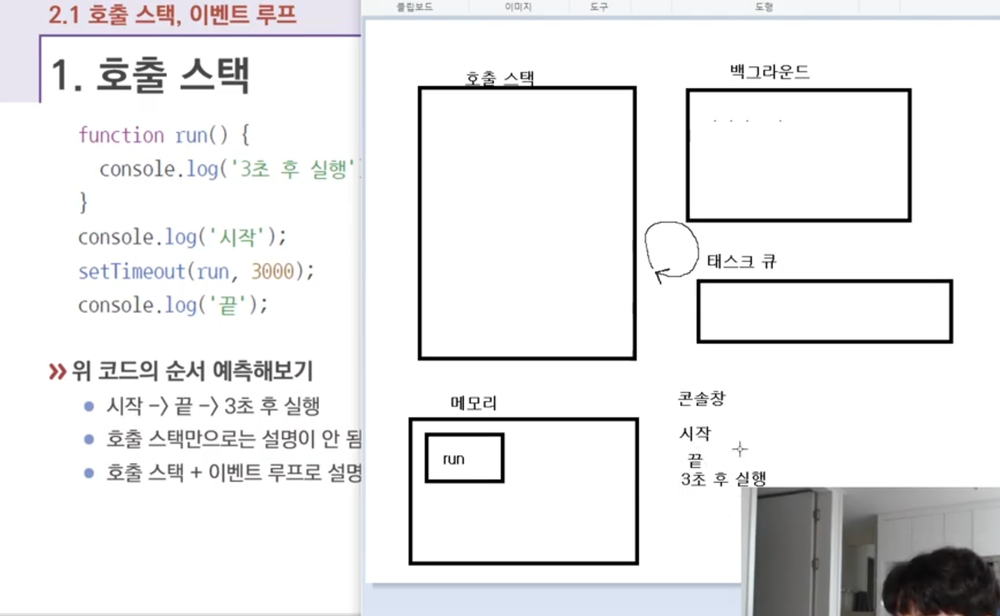
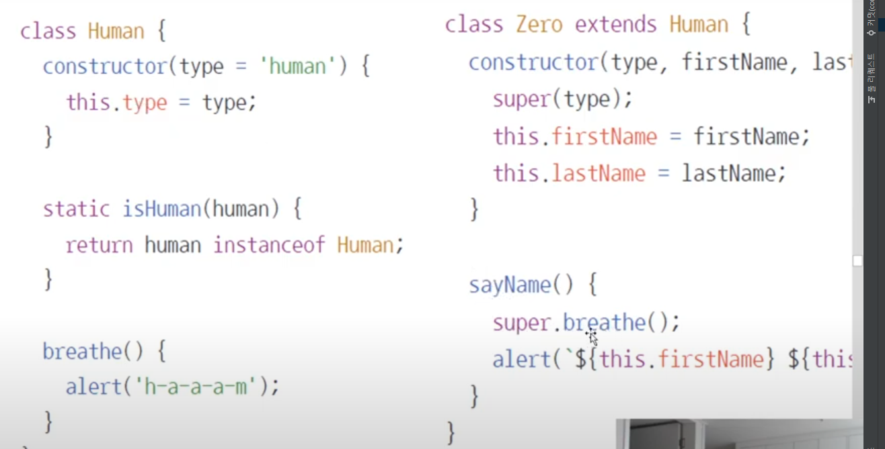

## 호출스택 개념
 - 호출스택 (함수의 호출, 자류구조의 스택)
 - Anonymous은 가상의 전역 컨텍스트(항상있다고 생각하는게 좋음)
 - 함수 호출 순서대로 쌓이고 역순으로 실행됨
 - 함수실행이 완료되면 스택에서 빠짐
 - LIFO 구조라서 스택이라고 불림
  
 - 처음에 호출스택에 쌓이고 완료되면 나가는 구조이고
 - setTimeout은 비동기이고, 비동기는 백그라운드로가서 호출스택과 같이 실행된다.
 - 먼저 console.log 시작이 실행되고, 완료 -> setTimeout실행되지만 바로 백그라운드로 이동
 - 그다음 console.log 가 실행 완료 -> 이제 마지막으로 백그라운드에 남아있던 타이머
 - 테스크큐로 run함수가 이동을하고 - > 그 다음 호출 스택으로 이동
 - 또 run()의 console.log 가 실행되고 콘솔에 찍힘 그리고는 끝~!
 - ** 백그라운드로 보낼수 있는것들은 한정적이라 멀티로 돌리는것도 한정적임 거의다 호출스택으로 처뤼 백그라운드는 c++임

## 화살표함수 딴건 설명들었던거라 알겠는데
 - function() 과 화살표 함수의 차이점은 알테고,,,,
 - 왜 아직 function() 이 살아있냐면 this 때문임! 화살표함수의 this는 부모의 this랑 같음
 - 그래서 (e)=>{e.target.xx)가 되기 때문에 완젼히 다르게 진행됨
 - function의 this는 그냥 그 this임

### 정리하자면 this를 쓸거면 function()을 쓰고, 아니면 화살표함수로 통일허자

## 클래스

 - 상속하기 개편해짐
 - super(type)하면 상속받은 human의 type를 실행하면됨
 - suepr.breathe()실행하면 부모의 breathe() 실행되는거임

